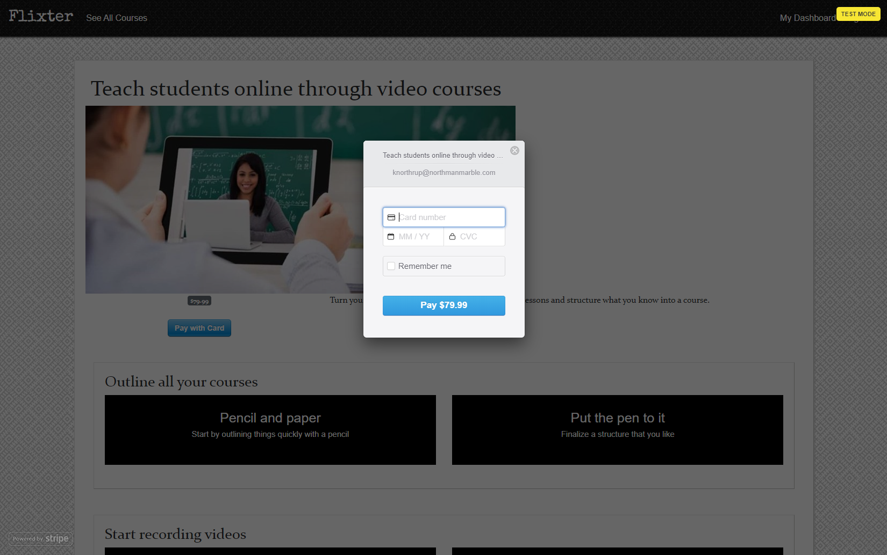

# Flixter

Flixter is a two-sided, video-streaming marketplace platform that features credit card payment capabilities, user role management, complex user interfaces, and advanced database relationships.
  
  
[View the deployed application](https://flixter-kevin-northrup.herokuapp.com/)
___

### Features:
- Built using Ruby on Rails
- PostgreSQL for database queries
- Twitter Bootstrap3 for CSS and UI components
- Modals for course/lesson submissions and card payments
- Amazon Web Services (AWS) for photo storage
- Devise gem for user authentication
- Simple Form gem for form generation
- Validation of form inputs
- CarrierWave gem for image uploading
- MiniMagick gem for image resizing
- Stripe integration for card payments
- jQuery utilized for drag-and-drop reordering of courses and lessons
- User dashboard lists courses uploaded by user and courses in which they are enrolled

___
### Screenshot:

